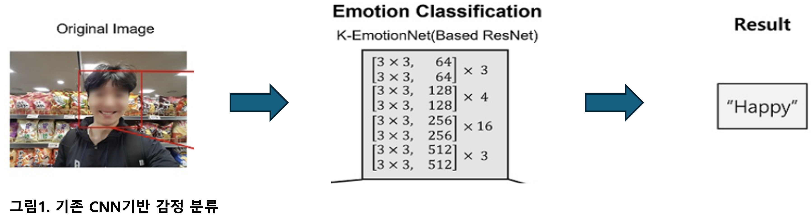
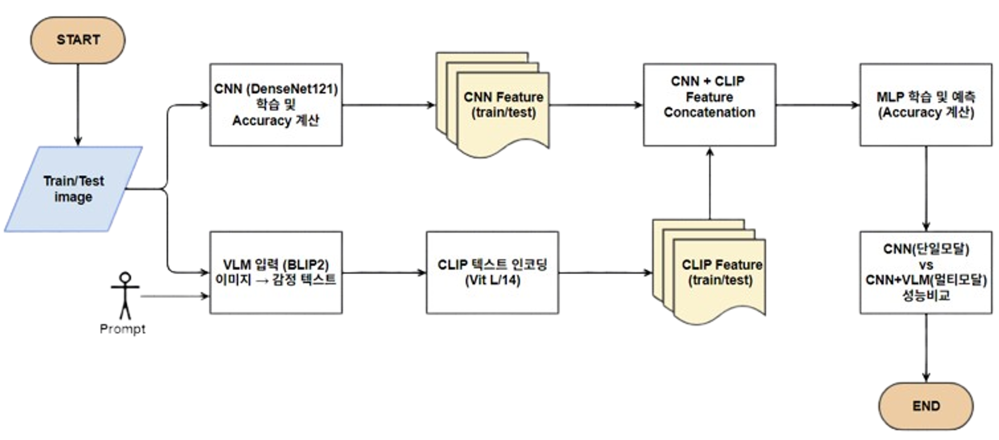
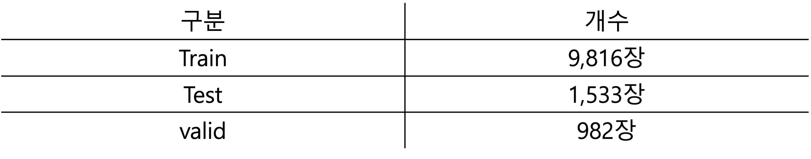
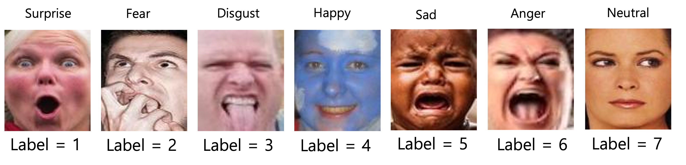
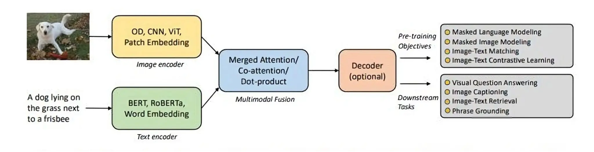
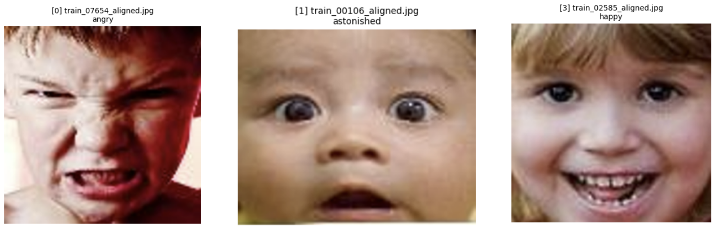
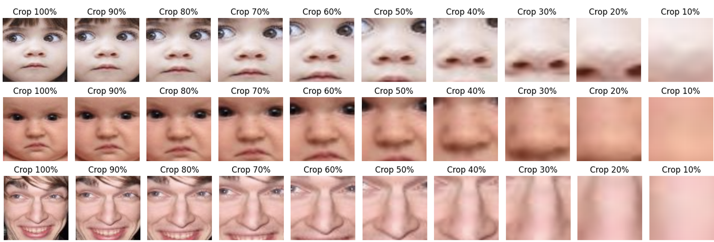

# AI-Project

# 멀티모달과 단일 CNN 모델의 얼굴 감정 인식 성능 비교 연구
> 얼굴 이미지 기반 감정 인식에서 단일 CNN과 멀티모달 구조의 성능을 비교한 AI 프로젝트입니다.

---

## 1. Motivation

최근 AI 기술의 발전으로 감정 분석 기술의 중요성이 증가하고 있습니다.  
기존 CNN 기반 감정 분류는 시각적 특징만 반영하기 때문에 감정의 복합성과 문맥 이해에는 한계가 있습니다.  
본 프로젝트에서는 VLM(Vision-Language Model)을 활용해 자연어 기반 설명을 CNN feature와 결합하여  
정적 이미지에서의 감정 인식 성능을 향상시키는 멀티모달 구조를 제안합니다.

  

---

## 2. Related Work

- [Yang et al. (2024)](https://arxiv.org/abs/2404.07078),  
  *VLLMs Provide Better Context for Emotion Understanding Through Common Sense Reasoning*  
  → 이미지 속 인물의 감정을 상식 기반으로 이해하는 데 있어 VLM의 효과를 강조한 논문

- LLaVA 및 QFormer 등을 활용한 이미지-텍스트 융합 기반 감정 추론 사례 소개

  

---

## 3. Flowchart

1. CNN 모델 학습 및 feature 추출  
2. BLIP2로 이미지 설명 문장 생성  
3. CLIP으로 텍스트 임베딩  
4. CNN + CLIP feature 결합 및 정규화  
5. 다양한 MLP 및 Attention 구조 학습  
6. Flask 웹으로 결과 시각화

  

---

## 4. Dataset

- **RAF-DB** (Real-world Affective Faces Database)  
- 총 이미지 수: 15,339장  
  (Train: 9,816 / Val: 2,455 / Test: 3,068)  
- 클래스 불균형 존재 → 일부 클래스에 augmentation 적용 (flip, rotate 등)

  

  

---

## 5. CNN (Baseline)

- 모델 후보: VGG16, ResNet18, DenseNet121
- 데이터셋: RAF-DB  
- Hyperparameter: Batch size=64, Epochs=30, LR=0.001, EarlyStopping(patience=5)

| Model     | Accuracy | F1-score |
|-----------|----------|----------|
| VGG16     | 0.6680   | 0.6558  |
| ResNet18  | 0.7462   | 0.7348   |
| **DenseNet121** | **0.7697**   | **0.7666** |

>  **DenseNet121**은 정확도와 F1-score에서 가장 우수한 성능을 보여,  
> 본 프로젝트의 최종 baseline CNN 모델로 선정되었습니다.

---

## 6. VLM

- BLIP2: 이미지 → 설명 문장 생성  
  (Prompt 예시: *“What emotion is the person showing?”*)  
- CLIP: 생성된 문장을 768차원 텍스트 임베딩으로 변환

  

- Prompt 결과

  

---

## 8. Feature Extraction & Fusion

- CNN: 1024차원 feature 추출  
- BLIP2 + CLIP: 768차원 텍스트 임베딩  
- 두 feature를 concat 후 L2 정규화하여 MLP 입력으로 사용

  

---

## 9. MLP Training & Results

- 다양한 구조 실험: 1~3 Layer, BatchNorm, LeakyReLU, Attention 등  
- Best Model: MLP + Attention  
- 최종 성능:  
  - Accuracy = 0.8139  
  - F1 = **0.8226**  
- 특히 `fear`, `neutral` 등에서 성능 대폭 향상

---

## 10. Problems & Improvements

- **BLIP2 프롬프트 품질 문제**  
  → 부정확하거나 반복적인 응답 발생, 감정 단어 대신 설명 출력

  

- **데이터 불균형**  
  → 소수 클래스 학습 불안정, 향후 `class_weight` 적용 예정

  

  

- **Augmentation 실험의 일관성 부족**  
  → crop 제외, flip 위주로 통일. Crop 비율 조정 실험 필요  

  

---

## 11. Flask

- 사용자 로그인 및 이미지 업로드  
- 감정 예측 결과 + 랜덤 피드백 코멘트 출력  
- 감정 분석 결과 DB 저장 (SQLite + SQLAlchemy)  
- 사용자별 분석 히스토리 + 대시보드 시각화 (matplotlib)  
- 관리자 페이지에서 전체 예측 기록 조회 및 삭제  
- 외부 접근은 `ngrok`을 통해 웹 공유 가능

---
